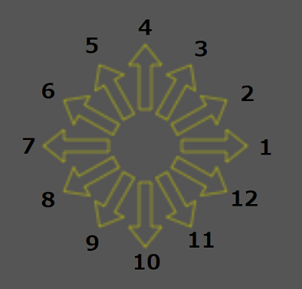

# abstructure

## [ Japanese ]
### 概要
構造式を描画するアプリケーションは様々あるが
- Webブラウザ上で動く
- 無料で使用できる
- オープンソースである(有志で機能を追加できる)
- キーボード操作で作成できる

といったような条件に当てはまるアプリケーションは現在殆ど存在しない。 
abstructureは、上記の要件を満たすように設計された構造式描画アプリケーションである。

### 現在できること、できないこと
#### できること
- 一次結合の描画
- 環状構造の描画
-
- Chemfig で同様の構造式を描画するコードの生成
#### できないこと
- 二重、三重結合の描画
- 立体構造の描画

### [ 使用方法 ]
- 矢印キーで骨格を描画することができる。
    - 通常では45°毎の8方向に移動することができる。斜めに移動する際は、一方のキーを
    押しながら隣のキーを押す必要がある。 
    例) 左上に移動する場合: 左キーを押しながら上キーを押す or 上キーを押しながら左キーを押す
    - 「/」キーを押すことで、30°毎の12方向の描画に切り替えることができる。斜めに移動する場合の
    操作方法は8方向の場合と若干異なる 
    例) 北北東の方向(図の3番の向き)に移動する場合: 上キーを押しながら右キーを押す 
    右キーを押しながら上キーを押した場合には、東北東(図の2番の向き)に移動してしまう。

- 各点で元素を入力する、下付き文字を使用する際にはアンダーバーを用いる
    - 例) CH_3, NH_3, N_2
- 一度訪れた点を再度訪れても、骨格は追加されない。従って、矢印キーのみでは 
環状構造を描画することはできない、環状構造を描画するためには「:」キーを押して 
「Chain mode」に切り替える必要がある

#### Chain mode の説明
- 今まで訪れた各点の左上に番号が表示される
    - A番とB番目の元素間で結合を作成したい場合には、キーボードで 
    A → Enter キー → B → Enter キー の順に入力する 
    例) 4番目と11番目の元素間で結合を作成するには 
    4 → Enter キー → 11 → Enter キー の順で入力する
- 矢印キー操作を行うことはできない
- Chain mode を抜けるには、再度「:」キーを入力する

